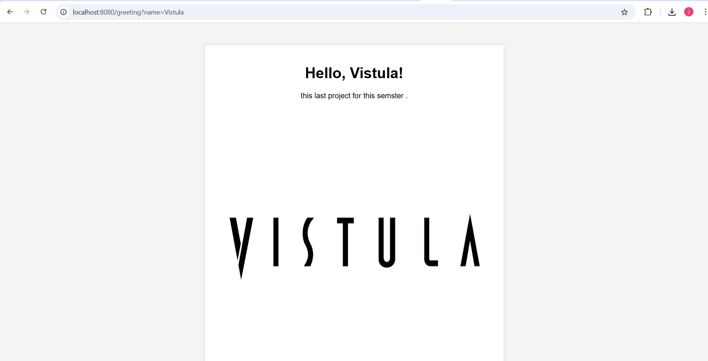
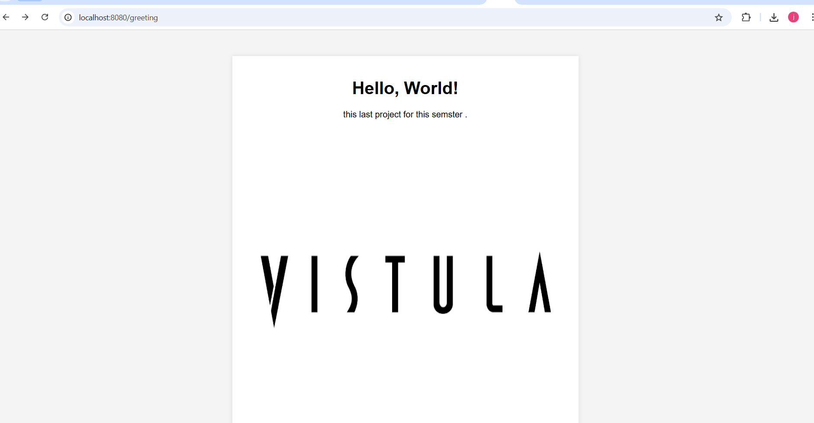

# Spring Web App

This is a basic Spring Boot web app that:
- Accepts a `name` parameter in the URL
- Displays a greeting using Thymeleaf
- Shows an image

## How to run

1. Run the application
2. Open your browser at:  
   `http://localhost:8080/greeting?name=Winnie

## Technologies Used

- **Java 21+**
- **Spring Boot**
- **Spring Web**
- **Thymeleaf** (template engine for HTML)
- **Maven** (build tool)
- **IntelliJ IDEA** (development environment)
- **Git & GitHub** (version control and hosting)`

## Screenshot of Result

